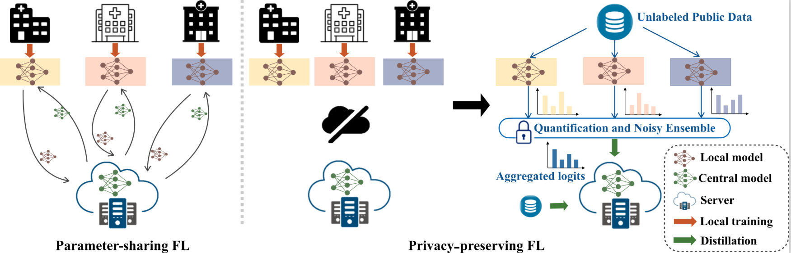

# Federated Learning w/ Knowledge Distillation



This repository contains the implementation for [Preserving Privacy in Federated Learning with Ensemble Cross-Domain Knowledge Distillation (AAAI 2022)](https://ojs.aaai.org/index.php/AAAI/article/view/21446).

Contact: Xuan Gong ([xuangong@buffalo.edu](mailto:xuangong@buffalo.edu))

## Federated distillation with multi communication rounds
```python
python main.py --alpha 1.0 --seed 1 --C 1
```

## Oneshot federated distillation
```python
python main.py --alpha 1.0 --seed 1 --C 1 --oneshot
```

## Oneshot federated distillation with quantization and noise
```python
python main.py --alpha 1.0 --seed 1 --C 1 --oneshot --noisescale 1.0 --quantify 100
python main.py --alpha 0.1 --seed 1 --C 1 --oneshot --noisescale 1.0 --quantify 100
python main.py --alpha 1.0 --seed 1 --C 1 --dataset cifar100 --oneshot --noisescale 1.0 --quantify 100
python main.py --alpha 0.1 --seed 1 --C 1 --dataset cifar100 --oneshot --noisescale 1.0 --quantify 100
```

## Citation
```bibtex
@inproceedings{gong2022preserving,
  title={Preserving Privacy in Federated Learning with Ensemble Cross-Domain Knowledge Distillation},
  author={Gong, Xuan and Sharma, Abhishek and Karanam, Srikrishna and Wu, Ziyan and Chen, Terrence and Doermann, David and Innanje, Arun},
  booktitle = {Proceedings of the AAAI conference on Artificial Intelligence},
  pages     = {11891--11899},
  year      = {2022},
}
```